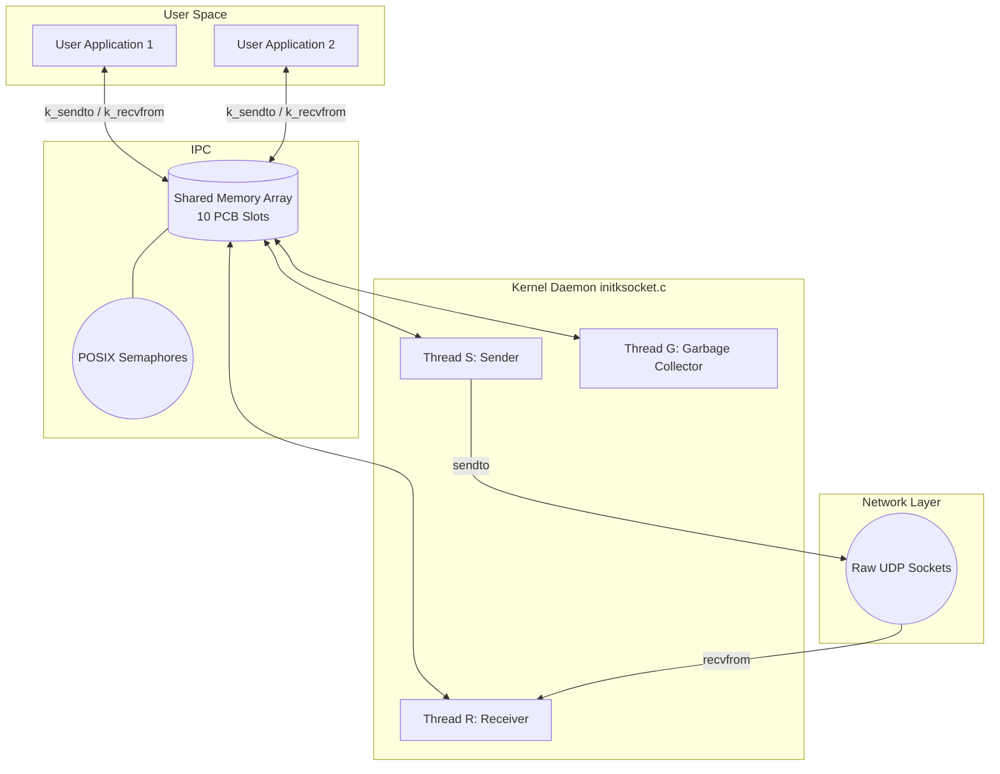

# KTP: KGP Transport Protocol 🚀

KTP is a custom, message-oriented transport layer protocol that provides **end-to-end reliable data transfer** over inherently unreliable UDP communication channels. It emulates OS-level network stack behavior by separating the user application from actual network transmission using a background Kernel Daemon and POSIX Shared Memory (IPC).

## ✨ Key Features
* **Reliable Delivery over UDP:** Guarantees in-order message delivery despite packet loss.
* **Sliding Window Flow Control:** Implements Go-Back-N retransmission with dynamic sender/receiver windows (`swnd` and `rwnd`).
* **Kernel-Space / User-Space Decoupling:** User applications link against a static library (`libksocket.a`) and communicate with a background daemon via Shared Memory.
* **Multithreaded Daemon:** Features dedicated threads for sending (Thread S), receiving (Thread R), and a Garbage Collector (Thread G) to manage dead processes.
* **Simulated Packet Loss:** Built-in network chaos simulation to test protocol resilience under varying drop probabilities.

## 🧠 Architecture Overview

🛠️ Getting Started
Prerequisites

    A Linux environment (or WSL)

    gcc compiler

    make utility

Building the Project

Clone the repository and compile the background daemon and static library:
Bash

    make all

Running the Protocol

    Start the Kernel Daemon:
    The daemon must be running in the background to manage the shared memory and actual network interfaces.

    make runinit

Run the User Applications:
In a separate terminal, start the user applications to test file transfer:
Bash

    make runuser

🧪 Testing Network Unreliability

The protocol's resilience can be tested by tweaking the packet drop probability. In ksocket.h, modify the macro P:

    #define P 0.15 // 15% chance of dropping a packet

Recompile and run to observe the Sender Thread handling timeouts and Go-Back-N retransmissions.
👥 Authors

    Hritwik Upadhyay (23CS30023)

    Ritabrata Sarkar (23CS30045)

Developed for the CS39006 Networks Laboratory Mini-Project 1.
